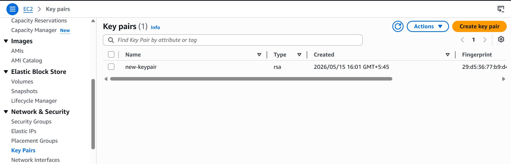

# Attaching-New-Keypair-to-EC2_Instance
Adding the keypair to the ec2 instance which was created without it.

## Step-1: Create a new keypair
In AWS console:
- Open aws ec2 console
- Goto **key Pairs**
- Click **Create key pair**
- Download the ```.pem``` file


## Step-2: Extract the Public key locally
Run on your local machine
```
ssh-keygen -y -f <new-keypair.pem> > new-keypair.pub
```
Note: Above command generates a public key from the private key file (new-keypair.pem) and saves the output to the new-keypair.pub file

## Step-3:

## step-4:
