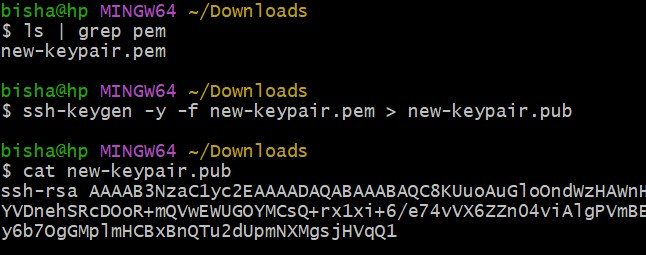
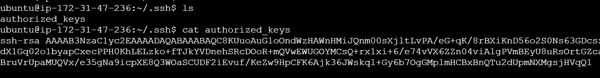

# Attaching-New-Keypair-to-EC2_Instance
Adding the keypair to the ec2 instance which was created without it.

## Step-1: Create a new keypair
In AWS console:
- Open aws ec2 console
- Goto **key Pairs**
- Click **Create key pair**
- Download the ```.pem``` file
  


## Step-2: Extract the Public key locally
Run on your local machine
```
ssh-keygen -y -f new-keypair.pem > new-keypair.pub
```
Note: Above command generates a public key from the private key file (new-keypair.pem) and saves the output to the new-keypair.pub file




## Step-3: Copy the public key to the EC2 instance
- Connect to your instance using **EC2 Instance Connect**
  

- Create the ~/.ssh directory if it doesn't already exist
```
mkdir -p ~/.ssh
```
- cd ~/.ssh
- ls
- Paste the contents/value of new-keypair.pub in **authorized_keys**

  

## step-4: Test the SSH
From your local machine
- Set file permissions so only the owner can read the private key:
  ```
  chmod 400 new-keypair.pem
  ```
- Connect to a remote Ubuntu server using SSH with the private key (new-key.pem) for authentication, replacing YOUR_PUBLIC_IP with the server’s actual public IP address:
  ```
  ssh -i new-key.pem ubuntu@YOUR_PUBLIC_IP
  ```
